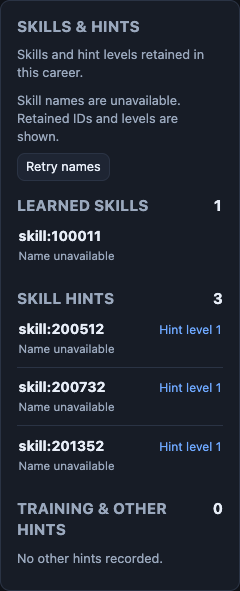
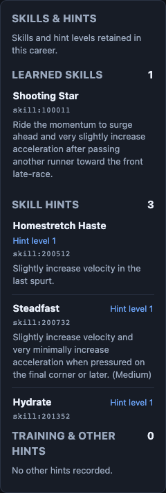

# UMA: retained skills and hints

This packet qualifies a player-facing Skills & hints panel for careers in [Jacob-Met/uma-sim](https://github.com/Jacob-Met/uma-sim). The active Run view now shows every retained learned skill, explicit skill hints and other training/raw hints, with catalog names when available and literal IDs otherwise. It reads the career's retained data; it does not infer purchases, discounts, skill activation, game accuracy or simulation outcomes.

The source is published in [PR99](https://github.com/Jacob-Met/uma-sim/pull/99), under [claim96](https://github.com/Jacob-Met/uma-sim/issues/96). Final published source head is **d4c208e46382b7f69f1ffea57474df46b38c7a8b**, with exact qualified tree **8aa5b3588ce8d6e315d295cd96d690e71875fe14**. Source publication and isolated native receiving are complete. Canonical merge remains root's action at this snapshot; an installed private package or release is not claimed.

Implementation owner: `chatgpt-d98d06fbfc35/qualify_integration`. Independent reviewer: `chatgpt-d98d06fbfc35/mac_execution`. Root reviewed the implementation, source composition and final wording. The existing UMA session/keyboard, race-history, paired-batch, career-lab and private-package owners were preserved. [Ownership and connector observations](github-review-before-copy.json) retain the claim and PR metadata, with the local acquisition recorded in [discovery-clone.json](discovery-clone.json).

## What changes

The Rust catalog adds a display projection keyed by exact skill ID and a read-only `GET /v1/catalog/skills`. Existing name normalization, alias precedence, hint resolution, startup initialization and RNG behavior remain unchanged. The handler takes no session or engine state. It clones display strings from the already initialized catalog.

The React panel derives rows from the current career props on every render. Learned order and duplicates are retained; the complete list is rendered in a bounded keyboard-focusable scroll area. Explicit `skill:` hints are separate from training/generic/raw hints. React text nodes keep IDs and metadata literal. Catalog failure, an older server's HTML fallback and retries retain the career view. Cleanup aborts metadata requests, including responses whose JSON resolves after an effect has been replaced.

The final review changes one text node from **Name not in catalog** to **Name unavailable**. The new wording is accurate while names are loading, unavailable or missing from the catalog. The existing global status supplies the more specific condition. [The one-line patch](copy-review-refinement.patch) and [its qualification](copy-review-refinement.json) are separate from the original frozen candidate.

## Exact source custody

| Stage | Commit | Tree / relationship |
|---|---|---|
| Original clean base | `2378365e48234c5ae3311e1b0dd7f1247a5a9071` | `04539ad9db458a59f6b044cc7686b7769def9d94` |
| Local feature source | `cddf3bd3859143bed598515ea62290024b461723` | `61fa398b04df853fd7610a200f85c30be7279f3a`; 11 changed files |
| Fresh main used for receiving | `4eab1798def5c19fbdee267eb2a6ea8a2726dbe7` | `bcd00030f309a41cb5670b509d41381f12d1e621` |
| Native current-main composition | `d22b71e105f93578dd2dd0f3ca75cde27f1a5a60` | `3ab69ccb1e3bf6d73b010824e7537391c5745d2e`; parents main4eab + localcddf |
| First published source | `79be98d225162699bf689c96024b760e09bb333a` | Same tested tree3ab69; sole parent4eab |
| Local copy refinement | `615f22ec96281ebcb1b67afa05874f12233a26c5` | `8aa5b3588ce8d6e315d295cd96d690e71875fe14`; parent79be98 |
| Final published source | `d4c208e46382b7f69f1ffea57474df46b38c7a8b` | Same tested tree8aa5; parent79be98 |

The 11 feature files are the catalog/API seams; App, package test command, panel, projection and CSS; two focused test files; documentation; and the native browser receiver. The current-main composition preserves all 1,305 unowned first-parent entries and the complete expected path set. Relevant intervening owner changes were confined to career-lab Markdown/ended-count behavior and one existing API report assertion; all were retained. [Composition](current-main-composition.json), [input drift](current-main-api-drift.patch), [career-lab drift](current-main-career-lab-drift.patch) and the losslessly compressed [full entry map](current-main-unowned-entry-map.json.gz) retain this proof.

The final copy child changes only `SkillsPanel.tsx`, blob `0ce451024e053c6dbac74c5ebd4633ed1824827a`, SHA256 `2819e889e028641c6497206967c09ecfa49d5406c34b4131521cfd5d8aa7c5a1`. All other 1,315 first-parent entries and the full path set remain identical. [Native public readback](copy-refinement-publication-readback.json) binds the exact parent, tree and blob.

Native HTTPS publication initially refused noninteractive credential entry, recorded in [the unchanged refusal](source-publication-attempt.json). Publication then used the authorized GitHub Git-data connector: every source blob and resulting tree matched the native qualified tree. The connector generated a different commit envelope, explicitly distinguished above. Ordinary native HTTPS Git reads independently verified the published objects and branch. The copy update used `force=false` and expected old head79be98. [First publication](source-publication-readback.json) and [copy publication](copy-refinement-connector-publication.json) preserve those separate observations.

## Executed qualification

| Qualification | Result | Evidence |
|---|---|---|
| Baseline Rust and UI builds | Passed | [baseline-complete.json](baseline-complete.json) and baseline execution/log files |
| Rust display projection + existing hint routing | 3/3 passed | [candidate-v1-rust.stdout.txt](candidate-v1-rust.stdout.txt), [execution](candidate-v1-rust.execution.json) |
| Normal UI suite | 66/66 passed, including six new projection controls | [candidate-v1-ui.stdout.txt](candidate-v1-ui.stdout.txt), [execution](candidate-v1-ui.execution.json) |
| Historical baseline browser | Panel absent although skills/hints are retained; unknown endpoint returns HTML | [baseline receiving](browser-baseline-v1/receiving.json) |
| Feature browser fixture revision | 6/6 passed with unchanged production source | [v2 receiving](browser-candidate-v2/receiving.json) |
| Actual current-main Rust API + built Chrome app | 7/7 passed | [final receiving](browser-current-main-v3/receiving.json), [execution](current-main-browser.execution.json) |
| Independent actual React StrictMode late-JSON control | 1 focused case passed; two metadata GETs; zero native API calls | [independent review](independent/README.md), [result](independent/run-v2/result.json) |
| Final copy-only follow-up | Normal UI build and one focused actual built-display control passed | [build](copy-refinement-build.execution.json), [display](browser-copy-refinement-v2/receiving.json) |

The seven final native cases cover catalog access before any career without creating a session; 1,898 unique catalog IDs and a real native career; full snapshot/RNG byte equality through reads and rejected POST405; native checkpoint import/Resume showing all 33 retained skills, literal content and a 390px view; replacement by an empty checkpoint; HTML fallback and retry; and leaving a pending metadata request. The 33-skill completed checkpoint is an **authored fixture**, not a claimed simulated result. All runs used owned disposable storage/API/browser instances and scripted metadata faults. External browser requests were blocked; provider calls were zero.

The final copy display reused the already qualified current-main API binary, SHA256 `478a358f6d8687a3f69fd968b1ae26d829d48e8b5797bd866b352a6bd50aeeb1`. Only the UI was rebuilt. Four unavailable-name rows, the absent old text, correct global failure status and unchanged native snapshot were observed. [Built output hashes](copy-refinement-built-ui.json) and [the focused harness](copy-display-receiver.mjs) bind that result. The original behavioral matrix was not repeated for a text-node change.

## Preserved refusals and corrections

These observations remain unchanged and are not relabeled as successful candidate tests.

- The first baseline fixture requested unsupported race model `classic`; the API correctly rejected it. The fixture then used supported `physics`, recorded in [baseline-setup-refusal.json](baseline-setup-refusal.json).
- The initial browser fixture read `scrollTop` synchronously after an End key. Chromium had not applied the scroll yet. The first two native cases passed before that oracle failed. [The original result](browser-candidate-v1/receiving.json) and [original harness](browser-receiver-v1.mjs) remain. The corrected fixture checks focus/overflow and waits for the actual animation-frame scroll; production source stayed unchanged.
- The independent review's first private virtual-HTTP fixture timed out before component assertions. Its separately retained delivery-only revision uses direct private-page injection, with identical assertions and deferred JSON transport. [Independent history](independent/fixture-delivery-v1-to-v2.patch) retains both results.
- Builds update a tracked TypeScript build-info artifact. Only the worker's generated bytes were restored to their own HEAD version, with hashes retained. A later clean-worktree check also refused its own temporary dependency symlink; [the exact symlink-only resolution](copy-refinement-cleanliness-refusal.json) preserved the source commit and dependency target.
- Two packet reads briefly timed out; a bounded native read recovered the same endpoint and verified the exact independent manifest. No source or runtime effect resulted.

The initial PR snapshot reported mergeable=false, so no merge was attempted then. A later read reported mergeable=true. For original head79be98, the workflow query returned completed success for `ci`, `pr-test-gate` and `gitleaks-secret-scan`; combined statuses was empty. These observations do not establish protection settings or imply that later heads have the same checks. [Exact normalized observations](github-review-before-copy.json) distinguish them. Root owns the final expected-head merge and current gate review.

## Reproduction and receiving boundary

The tracked receiver is [packages/uma-sim-ui/tests/receiving/skills-hints-receiver.mjs](https://github.com/Jacob-Met/uma-sim/blob/d4c208e46382b7f69f1ffea57474df46b38c7a8b/packages/uma-sim-ui/tests/receiving/skills-hints-receiver.mjs). Build with the repository's locked Rust/npm inputs, then pass the built UI directory, an empty owned output directory, the built API binary and a Chromium executable. Exact native versions, commands, paths and source/binary hashes are retained in the execution receipts. Browser profiles, dependency trees and native binaries are not duplicated here; source, authored fixture definitions, raw results, output hashes and screenshots are retained. [Archive provenance](archive-provenance.json) binds lossless compression of the large maps/capsules to their original hashes.

The independent review is pinned to the frozen nine-file v1 source. The current-main composition and one-line copy refinement are separately qualified by the implementation owner and reviewed by root. This packet does not claim actual user adoption, installed package receiving, simulation accuracy or successful canonical merge. A later integration receipt should be appended rather than rewriting these dated facts.
