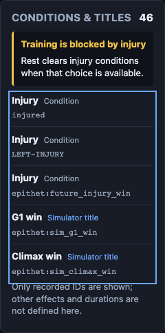
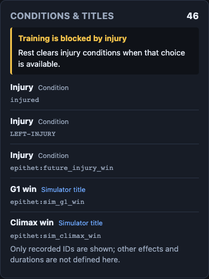

# Conditions and titles: native receiving

## What the player receives

The Run screen now exposes the career's retained condition and simulator-title
IDs beside the existing status information. An injury explains why training is
blocked; the text points to the existing Rest choice only when it is available.
Completed careers keep their injury record without suggesting recovery for an
ended run.

The three currently recognized simulator titles receive readable labels with
their exact IDs still visible. Unfamiliar IDs, duplicates, blank strings and
markup-like strings remain literal retained data. The panel does not invent
effects, durations or a complete official title catalog.

The user guide is [conditions-and-titles.md](../../conditions-and-titles.md).
The final native desktop and phone views are preserved below.

## Source and ownership

Source claim: [#103](https://github.com/Jacob-Met/uma-sim/issues/103), identity
`chatgpt:5f566b5ec8ef:mac_continuity`. This is a source-owned increment. The
native Conscience route was unavailable; no native append or resident worker
lease is claimed.

The qualified canonical baseline is
`205178f1bf3bf5f34c04bbda88c3e4df2102f535`, tree
`a0458be13b0a43575361e2fb8f9385f222683971`. The isolated native baseline commit
`ac242eb732eaad0e21032d76d5a25582cda90612` has all 1,346 canonical leaves and
modes exactly. Its commit identity is separate from the canonical history.

Product integration is a pure projection, one panel, its scoped stylesheet,
one App import and one placement after StatsPanel. The existing UI test script
adds the focused projection tests. Existing native engine/API inputs, session
and request handling, library operations, keyboard actions, race/training
panels, package dependencies and installed native packages are unchanged.
Removing the two App insertions reproduces the exact baseline App.

## Actual qualification

| Boundary | Recorded result |
| --- | --- |
| Existing UI suite plus nine focused controls | 75 passed, zero failed or skipped |
| Candidate and exact baseline UI production builds | Both exit 0 |
| Current locked native API build | Exit 0 on macOS arm64 |
| Original baseline browser | Actual resumed native career retains 46 entries; existing UI has no Conditions panel. One absence observation passed. The process later exits 1 on an inherited portrait-request guard. |
| Corrected candidate browser | Ten recorded checks pass, process exits 0, zero page errors |
| Existing native actions | Mandatory debut reaches FREE turn 2; real Rest advances to turn 3 and removes all four injury matches while preserving the other 42 entries |
| Read-only panel inspection | Complete snapshot and RNG unchanged; no action request caused by keyboard reading or scrolling |
| Completed, empty and phone states | Correct retained/empty text; all rows reachable; 348-pixel content fits the 390-pixel viewport without horizontal overflow |
| Browser network boundary | All 133 inherited catalog portrait attempts blocked; zero attempts outside the actual catalog URL set |

The native browser used actual Chrome 154 and the actual built UI against its
own native API process. It started a real private career, imported explicitly
authored checkpoints through the existing library API, resumed them through
the real Library screen and used the existing Race and Rest buttons. Authored
conditions are test fixtures, not claimed earned outcomes. No existing career
or provider was used.

The retained API executable is
`/Users/me/uma-conditions-20261008-5f566b5ec8ef/target/debug/uma-sim-api`,
14,269,024 bytes, SHA-256
`283c46e2a698dd1e258ef726ffd3816536c2f1f8fec7240168a4b0063e16a69a`.
Its source correspondence is in [native-api-build.json](evidence/native-api-build.json).
All three files in each executed UI build are pinned in the source freezes;
working source custody is distinguished from the separately executed UI assets.

The passing browser receipt is
[candidate-browser-fixed/receipt.json](candidate-browser-fixed/receipt.json),
SHA-256 `ec4563c95aa22cb3447e9d01604424a562f5d58d470e0388f949db94fa27a8c6`.
It records all ten observations, exact source/binary custody, authored snapshots,
actual request paths and blocked portrait URLs. Each completed observation also
has a separate progress record.

## Preserved failed phases

The first dependency attempt used the existing offline npm cache and failed
because `yallist@3.1.1` was unavailable. No dependent tests or build ran in that
phase. Normal installation from the exact unchanged lock succeeded; the UI
suite and both builds then passed.

The first baseline browser completed its meaningful absence observation, then
an overly broad guard counted the setup screen's existing catalog portraits.
All requests had been blocked. The receiver was corrected to keep blocking all
off-origin requests and to reject any attempted URL outside the actual native
catalog portrait set. The original baseline was not rerun or relabeled a pass.

The first candidate saved a correctly rendered panel, then waited for Rest in
the initial mandatory-debut state, where that choice was unavailable. An
unhandled request-wait rejection prevented its final receipt. Its process log,
authored checkpoint and screenshot remain intact; no unrecorded passing case
count is assigned. The narrowly scoped private native probe confirmed that the
existing Race choice reaches a state offering Rest, then terminated only the
orphaned receiver API process.

The maintained receiver now plays the mandatory debut before authoring its
injury fixture, awaits UI actions and responses together, and writes each
completed observation immediately. The product's six source/test files and
both qualified UI builds stayed byte-identical across these harness changes.
The corrected candidate alone was replayed; it passed in 5.05 seconds.

The original helpers, process drivers and phase receipts are preserved here.
Source freeze v1, v2 and v3 retain their actual native ancestry and timing.
The completed API build cache was retired only after checking that no process
held target files open; its original executable, all source, assets, logs and
receipts remain available.

## Reproduction and integration boundary

The guide documents the native build and receiver invocation. The maintained
receiver takes explicit built-UI, new-output and API-executable paths, plus an
optional Chromium executable. It refuses to reuse an output directory.

Independent source review accepted the exact classification, native action
semantics, literal rendering and App/package insertion boundary. Its
[corrected receipt](evidence/production-source-review-corrected.json) preserves
the original review and a name-only provenance correction; no tests or builds
were repeated by that reviewer.

Repository CI and final integration review are subsequent gates.
This packet claims the source increment and its isolated native qualification;
it does not claim replacement of an installed package or deployment.
